# Getting Started

Hello! If you've never used Salamandra, this tutorial is for you. We're going to show some of the software's functions so that you can get an idea of how to fulfill the basic needs of your radio.

Heads up! Here we assume that you already know the least about operating any software on your computer, giving just a general brushstroke on Salamandra's various options and how they can fit into the practical contexts of your radio.

The following topics will be explained in this tutorial:

- [Changing Salamandra's language](#linguagem-do-programa)
- [Creating a playlist with your music](#criando-a-playlist-musical)
  - [Understanding the Main Window](#entendendo-a-tela-inicial)
  - [Adding tracks to the playlist](#adicionando-faixas-%C3%A0-playlist)
- [Setting Time Announcement files path](#configurando-os-arquivos-de-locução-de-hora)
- [Scheduling advertisement blocks with Events](#agendar-um-bloco-de-anúncio-com-eventos)
  - [Scheduling Time Announcements](#agendando-as-locu%C3%A7%C3%B5es-de-hora)
  - [Scheduling Advertisements](#agendando-os-an%C3%BAncios)
    - [Setting event order on Upcoming Events queue](#customizando-a-ordem-dos-eventos) 
- [Scheduling advertisement blocks with Sequential Playlist](#agendar-um-bloco-de-an%C3%BAncios-com-playlist-sequencial)
  - [Sequential and rotation playlists](#playlists-sequenciais-e-rotativas)
- [Scheduling an music playlist](#agendar-uma-playlist-musical)
- [Scheduling an radio show with priorities](#agendar-um-programa-utilizando-as-prioridades)

# Linguagem do Programa

O Salamandra começa por padrão em Inglês, mas tem disponível tradução para Português. Para alterar a língua, acesse o menu **Tools > Settings** ou clique no botão superior de engrenagem e troque de English para Português na janela que se abrir, conforme a animação abaixo.

**É NECESSÁRIO REINICIAR O PROGRAMA PARA QUE ESTA CONFIGURAÇÃO SEJA APLICADA!**

	

# Criando a playlist musical

## Entendendo a Tela Inicial

Antes de começar a explicar como fazer a sua programação musical, vamos a uma breve descrição da tela inicial do Salamandra.

	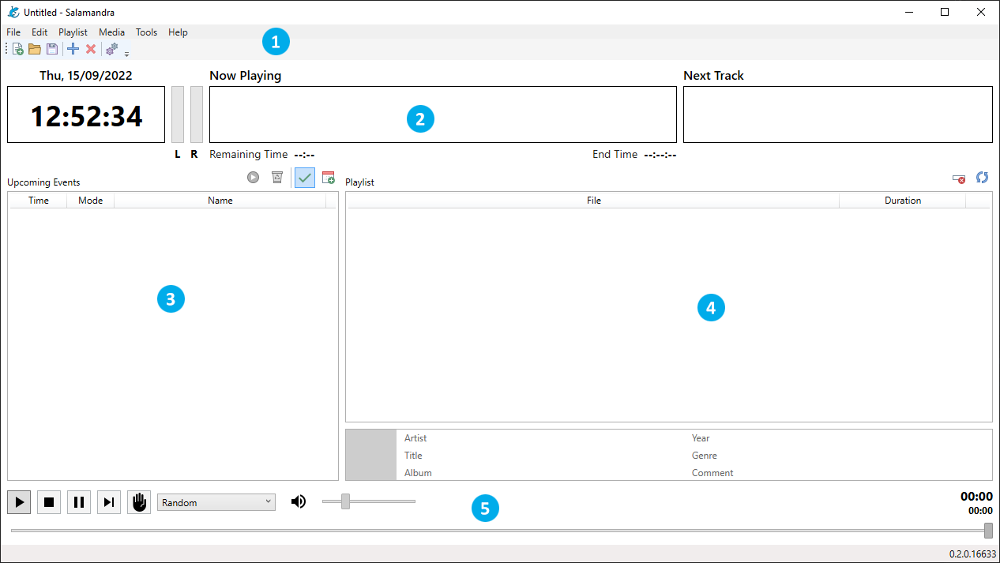

* 1 - **Menu Principal e Barra de Ferramentas** - Onde você poderá acessar as diversas funções do programa separadas em categorias.
* 2 - **Cabeçalho do Player** - Onde você poderá ver o horário, a faixa que está sendo reproduzida no momento e a próxima faixa.  
* 3 - **Planilha de Eventos** - Onde você poderá ver os próximos eventos que serão reproduzidos e também acessar o agendador de eventos.
* 4 - **Playlist** - Onde você poderá colocar as faixas que serão tocadas na sua rádio.
* 5 - **Controles do Player** - Controles do player, volume, modo da playlist e posição da faixa atual.

## Adicionando faixas à Playlist

Para adicionar faixas a playlist, você pode utilizar o menu **Playlist**, onde você terá a opção de adicionar os diversos tipos de faixa suportados pelo Salamandra, como faixas de áudio, locuções de hora ou arquivos aleatórios. 

É possível também arrastar arquivos direto do explorador de arquivos do sistema para a sua playlist. As faixas da playlist também podem ser reordenadas arrastando e soltando, para que você possa fazer colocar as músicas na ordem que deseja.

	

Para manter uma playlist já montada salva, basta utilizar o menu **Arquivo > Salvar** ou o botão de disquete na Barra de Ferramentas. Para abrir uma playlist salva, basta utilizar o menu **Arquivo > Abrir** ou o botão de pasta na Barra de Ferramentas.

Após montar a playlist, basta utilizar os **Controles do Player** para começar a tocar as suas músicas. Teste também os diversos modos da playlist, para ver as formas que o Salamandra define a próxima faixa a tocar.

# Configurando os arquivos de Locução de Hora

Para configurar os arquivos de Locução de Hora, basta acessar o menu **Ferramentas > Configurações** ou o botão de engrenagem na Barra de Ferramentas. Você então terá acesso a janela de Configurações.

Logo no fim da tela, você verá a opção **Caminho para arquivos de Locução de Horário**, basta clicar no botão [...] e selecionar a pasta onde estão seus arquivos de horário.

	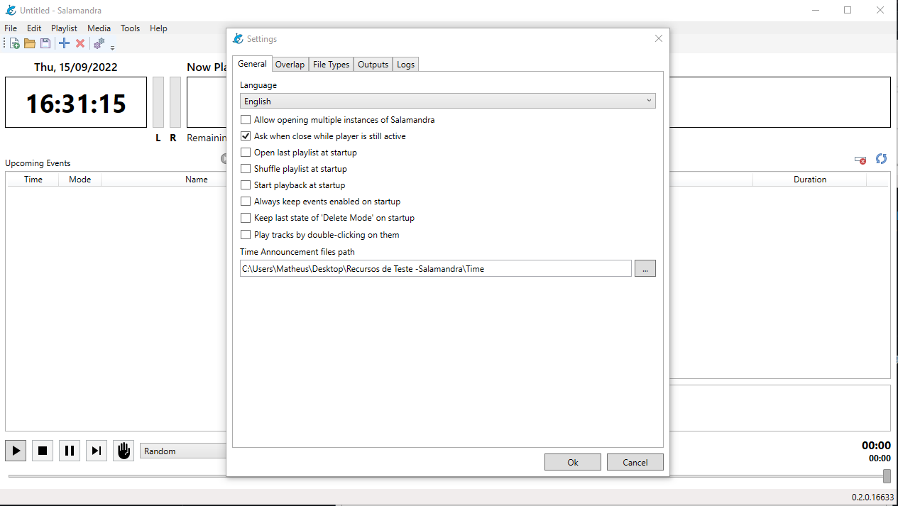

Os arquivos devem estar no seguinte formato: **HRSxx** e **MINxx**, onde o **xx** representa um número indicando o tempo. Um arquivo para 8h da manhã, por exemplo, seria **HRS08**, para o minuto 59, seria **MIN59**. Estes arquivos então são automaticamente combinados pelo Salamandra para indicar a hora nas faixas de Locução de Hora.

Os arquivos de locução de hora podem estar em qualquer um dos formatos de áudio suportados pelo Salamandra.

# Agendar um bloco de anúncio com eventos

A forma mais fácil de montar uma programação de bloco de anúncios ou agendar qualquer outra ação do player é através do agendador de eventos. Logo acima da **Planilha de Eventos**, clique no botão de calendário. Será aberta então a seguinte janela:

	

Esta janela mostra todos os seus eventos cadastrados, permitindo que você crie, edite ou exclua eventos.

## Agendando as Locuções de Hora

Vamos criar então alguns eventos de Locução de Hora que serão disparados de 15 em 15 minutos, para servir de abertura do nosso bloco de anúncios. Clique em **Novo** e siga os seguintes passos:

	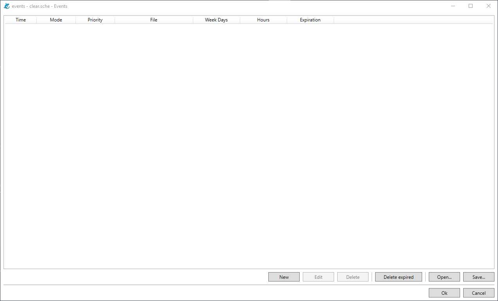

Como pode notar, teremos ao fim quatro eventos que serão disparados aos minutos 00, 15, 30 e 45. Vamos a uma explicação então do agendamento destes.

	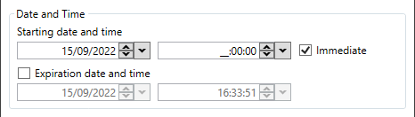

Em **Data e Hora de Início**, colocamos o horário do evento e logo em seguida, a primeira opção a ter sido marcada foi a opção **Imediato**. Esta opção significa que o evento entrará exatamente no horário agendado - **isso significa que qualquer música que esteja tocando será cortada para a entrada do evento**. Se você deseja que a música toque até o final para depois dela o evento ser reproduzido, não marque esta opção!

	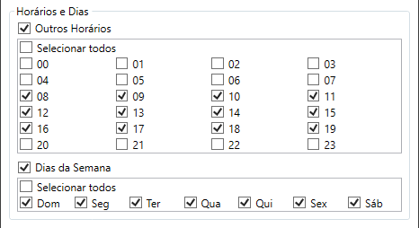

Vamos então a explicação da opção **Horários e Dias**. Quando marcamos **Outros Horários**, indicamos ao Salamandra que queremos que o evento toque em mais horários do que o configurado inicialmente (17:00:00). Podemos então marcar as horas, neste caso de 08h até 19h, que o evento será disparado. Caso você deseje que o evento toque apenas em um horário específico, não marque esta opção. 

Note que o horário original muda para (__:00:00), isto significa que o evento tocará em todos os horários selecionados aos zero minutos e zero segundos, 8:00:00, 9:00:00, 10:00:00, etc.

Já a opção **Dias da Semana**, torna o agendamento do evento periódico, assim como a opção anterior. Quando você marca esta opção, você indica ao Salamandra que deseja que o evento toque em mais dias do que só o configurado em **Data e Hora de Início**. Caso você deseje que o evento toque apenas em um único dia específico, não marque esta opção!

	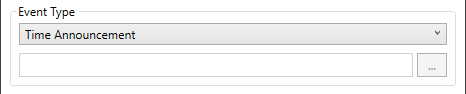

Após isto, basta selecionar o **Tipo de Evento**. Para as locuções de hora, basta nós selecionarmos **Locução de Hora**. Para arquivos de áudio, como veremos em seguida, devemos clicar no botão [...] e selecionar o arquivo que desejamos.

Para finalizar, como queremos que os eventos toquem de 15 em 15 minutos, basta copiar e colar o evento original e apenas trocar a minutagem de acordo.

## Agendando os anúncios

Vamos então agendar alguns anúncios para demonstrar. Para que a animação seja breve, vamos programar todos apenas para disparar no bloco dos 45 minutos. 

Se você deseja que seus anúncios disparem em outros minutos, basta então copiar e colar, assim como fizemos com as Locuções de Hora.

	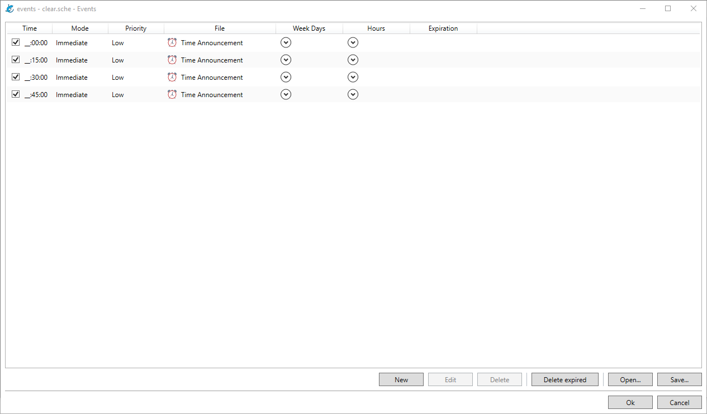

As diferenças de um agendamento para outro são poucas. Para agendar os anúncios, nós apenas não marcamos a caixa **Imediato**, já que os anúncios não devem cortar as músicas, nem um anúncio cortar o outro. O bloco será disparado pela **Locução de Hora**, esta sim que terá seu disparo no modo imediato.

Também diferente da Locução de Hora, para arquivos de áudio temos que obrigatoriamente selecionar o arquivo que será reproduzido pelo player.

Você deve notar que a Planilha de Próximos Eventos deve ficar da seguinte forma, ou parecida:

	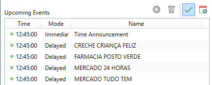

### Customizando a Ordem dos Eventos

Algo que pode acontecer em diversas rádios é ter anunciantes do mesmo segmento, em nosso exemplo, os dois mercados, e não é interessante anunciar eles um atrás do outro. Para evitar isso, podemos utilizar a opção **Ordem do Evento na Fila**. 

A ordem do evento é um número que varia de **0 a 99**, com todos os eventos iniciando em **50**. Para eventos que compartilham o mesmo horário, neste caso 10:45:00, esta é uma opção para customizar a ordem deles de acordo com a sua vontade. Podemos então pegar um dos mercados, neste caso o **Mercado 24 Horas** e modificar este valor.

	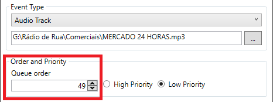

 Como os dois mercados estão na posição inferior na grade, devemos então mudar um deles para qualquer número menor que 50, neste caso 49, e confirmar. Assim, "puxamos" o anúncio para o topo do bloco, se fosse o contrário, colocariamos um número maior que 50, "empurrando" o anúncio para baixo.

Após essa alteração, os eventos então serão reposicionados na fila de Próximos Eventos, ficando desta forma:

	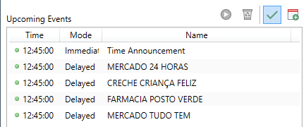

Assim conseguimos evitar que anúncios de concorrentes sejam anunciados um seguidos do outro, com um maior controle do nosso bloco de anunciantes.

# Agendar um bloco de anúncios com playlist sequencial

Para agendar um bloco de anúncios utilizando uma playlist sequencial, basta montar a playlist de anúncios no mesmo local da playlist musical. Ao salvar a playlist, selecione o formato **Playlist seq** e salve com o nome que desejar. **As playlists sequenciais só suportam arquivos de áudio no momento**, outros tipos de faixas não são suportadas.

	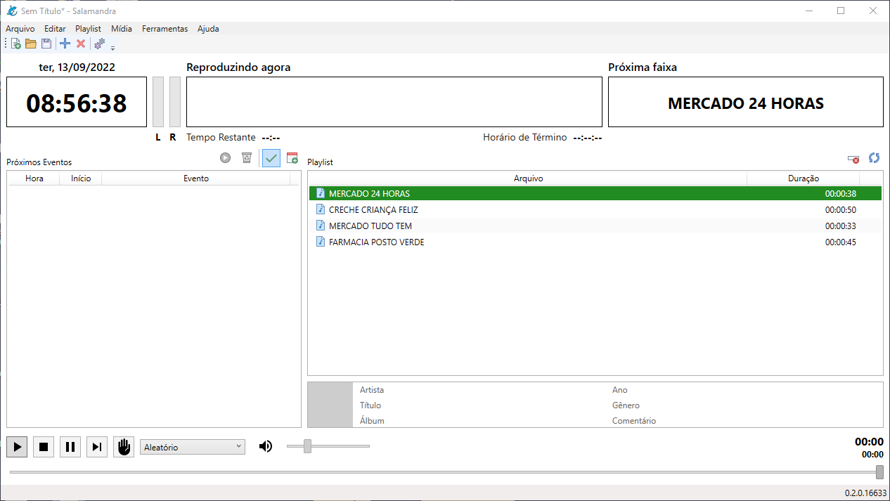

Ao agendar o bloco de anúncios, basta então selecionar **Arquivo de Playlist** como o Tipo do Evento e selecionar a playlist salva.

	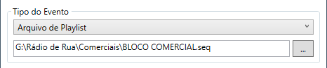

## Playlists Sequenciais e Rotativas

As playlists sequenciais são um tipo especial de faixa, na qual você pode colocar diversas faixas de áudio e **todas elas tocarão na sequencia salva até que termine a playlist**. São uma opção interessante para criar blocos customizados de anúncios como demonstrado acima.

Outro tipo especial de faixa são as playlists rotativas, nas quais **toda vez que ela for disparada, ela tocará somente uma das faixas de áudio, alternando entre as faixas salvas na playlist**. Você pode criá-las da mesma forma que as playlists sequenciais, mas salve como **Playlist rot**. Estas faixas são ótimas para quando você tem um anunciante com mais de uma versão de seu anúncio ou então diversas vinhetas que você deseja rotacionar.

# Agendar uma playlist musical

Aproveitando o assunto de playlists, para agendar uma playlist musical selecione **Arquivo de Playlist** como o Tipo do Evento e agendar a sua playlist. Para arquivos do tipo m3u ou lst, isto fará a grade músical ser trocada pela nova indicada no evento.

	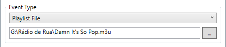

Esta opção é muito interessante para rádios que tem diferentes grades musicais durante o dia, ou diferentes grades por dia da semana. Basta montar e agendar suas playlists de acordo com os dias e horários desejados para tornar a troca da grade musical mais fácil.

Note que também há tipos de eventos especiais, como **Iniciar Playlist** e **Parar playlist**. Estes eventos simulam um clique no botão de **Play** e **Stop**, respectivamente, para que você possa agendar quando iniciar ou parar a reprodução do player, automatizando ainda mais o seu controle sobre os horários de sua rádio.

# Agendar um programa utilizando as prioridades

Para agendar um programa de rádio já gravado, basta utilizar a mesma forma que se utiliza para agendar um arquivo de áudio normal. Vamos dizer que nós queiramos agendar um programa de esportes que dure de 13:15 a 14:15. 

No nosso exemplo de blocos comerciais de 15 em 15 minutos, poderiamos utilizar a ordenação para este ser o primeiro evento a ser disparado, mas ainda assim, os outros eventos de comerciais ainda ficariam acumulados, prejudicando o restante da programação.

Para lidar com essa situação comum que pode acontecer na sua rádio, temos a opção de prioridades. Perceba que nos eventos que agendamos até aqui, todos eles, na parte de **Ordenação e Prioridade**, vem como padrão com a **Prioridade Baixa**. Podemos então pegar o nosso programa de esportes e marcar como **Prioridade Alta**.

	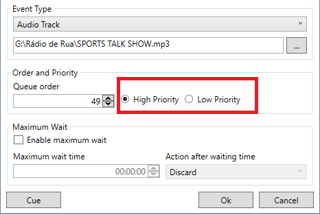

Dessa forma, todos os eventos que "concorrem" com ele pelo horário serão descartados enquanto ele estiver tocando, sem que você precise criar outra grade de eventos alternativa para encaixar o seu programa.

	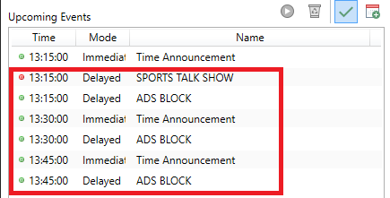

Com a opção de Prioridade Alta marcada, o nosso programa de Mesa Redonda muda seu ícone de **verde para vermelho** na grade de Próximos Eventos. Isso significa que enquanto este estiver sendo reproduzido pelo player, **todos os eventos posteriores (os marcados pela caixa vermelha e outros que possam surgir quando virar a hora) serão descartados enquanto o programa estiver tocando.**

Note o seguinte, a primeira Locução de Hora das 13:15 ainda tocará e logo em seguida o nosso programa de Mesa Redonda. Isto ocorre pelo seguinte: a ordenação da grade de eventos primeiro vem pelo **Horário**, logo em seguida se o evento é **Imediato ou Atrasado**, com prioridade para os Imediatos, e finalmente pela opção de **Ordenação**. 

Neste caso, se quisermos que nem mesmo a Locução de Hora toque, basta tornar a Mesa Redonda também Imediato e modificar a sua ordenação para ser menor do que a Locução de Hora.

	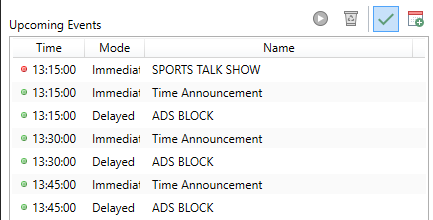

# Conclusão

Neste tutorial tivemos uma visão geral de como montar a programação de sua rádio e diversas situações e necessidades comuns que você pode ter durante o uso do Salamandra. Ainda há também muitas configurações e funcionalidades do próprio Salamandra que você pode utilizar para fazer ajustes finos de acordo com a sua necessidade.

Você pode por exemplo programar não somente outra grade musical para ser disparada, mas também outra planilha de eventos para quando houver necessidade de uma programação específica para um dia ou momento. Além do Salamandra, é possível buscar outros tutoriais, como sobre fazer seu computador ligar sozinho, utilizar o Agendador de Tarefas do Windows para iniciar/fechar um programa, entre outras funcionalidades de seu sistema operacional.

Através da criatividade para combinar e configurar seu sistema junto com a versatilidade dos eventos do Salamandra, é possível automatizar a sua rádio de forma que o trabalho manual fique somente para aquilo que seja realmente necessário o seu esforço =)