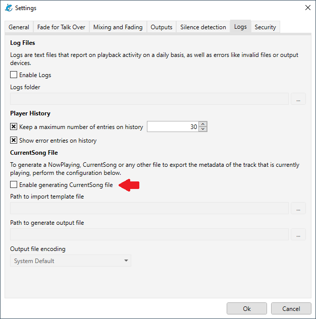
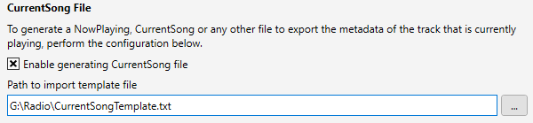
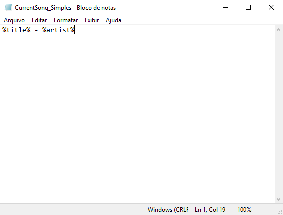
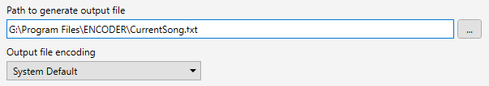

# How to create a CurrentSong file

- [Template File](#template-file)
  - [File Types](#file-types)
- [Output File](#output-file)
- [Tokens](#tokens)
  - [Audio Track Tokens](#audio-track-tokens)
  - [Other Tokens](#other-tokens)

Salamandra can export a CurrentSong/NowPlaying file, so that you can integrate the player metadata into another software, such as a streaming encoder.

You can access the CurrentSong settings through the menu **Tools > Settings**, then access the **Logs** tab and you will see the screen below.

    

To generate a CurrentSong file, first of all, it is necessary to activate the option **Enable generating CurrentSong file**.

## Template File

By default, Salamandra generates the CurrentSong with the name of the audio file that is playing, however it is possible to create your own template. To set the output layout you need, you must choose the **Path to import template file**.

    

The template can be a plain text file or even another more structured format, such as XML. To create your template, just use a simple text editor such as **Notepad** and see the list of tokens below to find out what data Salamandra will output.

You can see some examples below: 

<strong>Simple CurrentSong template</strong>

    

<strong>Structured CurrentSong template</strong>

    

With this setting, Salamandra manages to generate an output file in the format desired by the user, which can be adjusted to be read by any software that needs this information.

### File Types

Usually, the metadata/tags of songs is more complete than that of advertisments or pre-recorded shows, for example. For these, if you wish, you can customize the template that will be used as well, through the File Types.

## Output Files

To generate the output file, set the **Path to generate output file** setting. This is a text file, but there is no default extension. You can define the output file as **TXT**, **XML**, just setting the extension with the file name, according to your needs.

    

**Watch out for the output file encoding setting!** Your streaming program may ask for a specific text encoding, so check this setting if you experience any problems.

## Tokens

### Audio Track Tokens

**%friendlyname%** - The "friendly name" of the track. Usually the file name without its extension.

**%durationInSeconds%** - Audio file duration in seconds.

**%artist%** - Audio file artist tag.

**%title%** - Audio file title tag.

**%album%** - Audio file album tag.

**%track%** - Audio file track tag.

**%year%** - Audio file year tag.

**%genre%** - Audio file genre tag.

**%composer%** - Audio file composer tag.

**%comment%** - Audio file comment tag.

### Outros Tokens

#### Hora

**%time_now_hour%** - Current hour

**%time_now_minute%** - Current minute

**%time_now_second%** - Current second

**%time_now_short%** - Current time in short format

**%time_now_long%** - Current time in long format

#### Data

**%date_now_day%** - Current day (numeric)

**%date_now_month%** - Current month (numeric)

**%date_now_year%** - Current year (numeric)

**%date_now_short%** - Current date in short format

**%date_now_long%** - Current date in long format