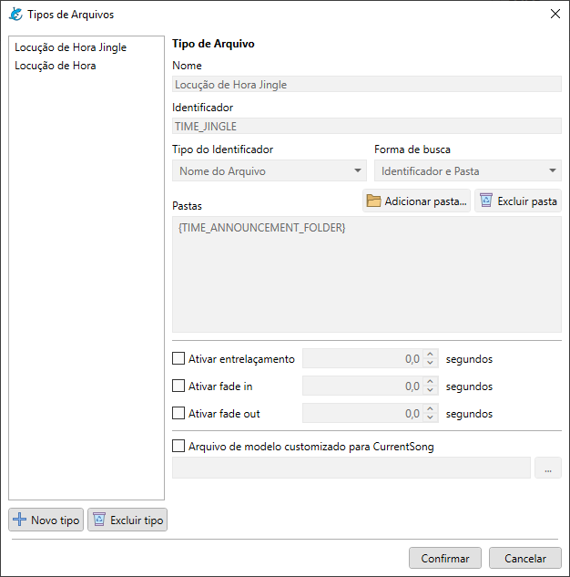
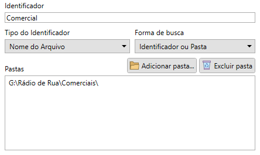
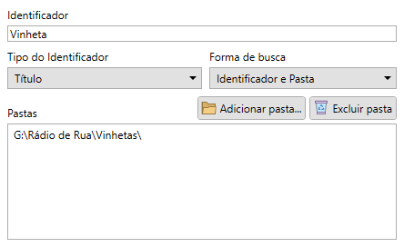
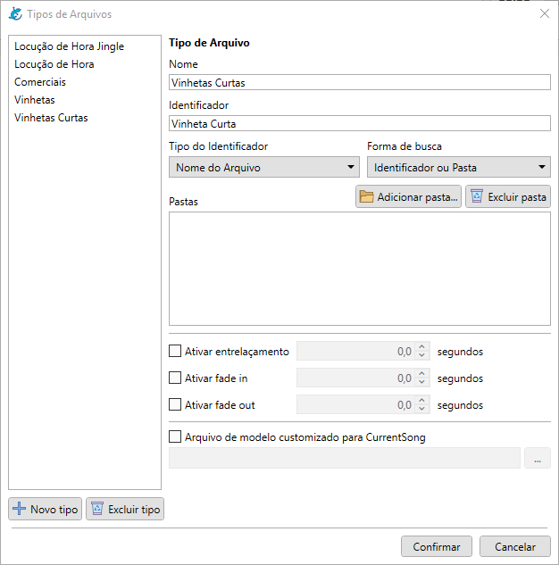
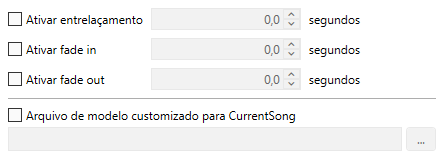

# Tipos de Arquivo

No Salamandra, você pode configurar a mixagem dos arquivos de áudio de uma forma generalizada através das **Configurações**. Porém, para outros arquivos, como Comerciais, Vinhetas e afins, pode ser necessário fazer uma configuração diferente. Essa configuração você pode fazer através dos Tipos de Arquivo.

Para acessar a configuração dos Tipos de Arquivo, vá no menu **Ferramentas > Tipos de Arquivo**. Você então verá a janela abaixo:

	

Como pode ver, há alguns tipos previamente cadastrados para a Locução de Hora. Para criar um novo tipo customizado, clique no botão 'Novo Tipo', na parte inferior da Tela.

Você poderá digitar um nome para descrevê-lo, como Comerciais, Vinhetas, ou etc. Após entrar com o nome, vamos explicar sobre os **Identificadores**:

## Ientificadores

	

Temos quatro atributos muito importantes nessa parte! Dois deles são a informação que o Salamandra buscará para **identificar o arquivo** e dois deles a **forma que a informação poderá ser encontrada**.

## Informações para Identificação

O identificador é um texto que será buscado pelo Salamandra nos dados do arquivo, na imagem, por exemplo, "Comercial" é uma informação que o Salamandra buscará no **Nome do Arquivo**.

As pastas são outra forma de identificar um arquivo. Neste exemplo, todos os arquivos contidos em "G:\Rádio de Rua\Comerciais\" serão considerados do tipo de arquivo **Comerciais**.

## Informações para Busca

Temos então a forma de guiar o Salamandra para encontrar o Tipo de Arquivo para uma faixa de áudio. São os atributos de **Tipo do Identificador** e **Forma de Busca**.

Para o **Tipo do Identificador**, é possível escolher o Nome do Arquivo, ou as tags MP3 de Artista, Título ou Comentário. O Salamandra então buscará a informação do Identificador em qualquer parte de um desses quatro campos registrados no arquivo. No exemplo acima, um arquivo que tenha "Comercial" em seu nome será considerado do tipo de arquivo **Comerciais**.

A **Forma de Busca** é uma informação que deve ser considerada de forma cuidadosa. É possível escolher uma de duas opções, **Identificador OU Pasta** ou **Identificador E Pasta**.

	

Para a forma de busca **Identificador OU Pasta**, o Salamandra verificará se o arquivo pertence as pastas listadas em um Tipo, ou se ele contém o Identificador em um dos seus campos. No exemplo acima, se o arquivo tiver "Comercial" em seu nome ele será do tipo **Comerciais**, mas mesmo que não tenha, se ele estiver contido na pasta "G:\Rádio de Rua\Comerciais\", ele será do tipo **Comerciais**.

A imagem abaixo ilustra outra situação:

	

Para este, que está com **Identificador E Pasta**, o arquivo de áudio terá que conter "Vinheta" em sua tag de Título e TAMBÉM estar contido na pasta "G:\Rádio de Rua\Vinhetas\" para ser considerado como um arquivo de tipo **Vinhetas**. Somente ter a informação no Título ou estar contido na pasta não será o suficiente para ser deste tipo de arquivo, mas AS DUAS condições deverão ser atendidas para ser considerado como pertencente ao tipo **Vinheta**.

# Ordem dos Tipos

Os Tipos de Arquivos são aplicados com uma ordem de preferência de cima para baixo. Digamos que dentro de nossa pasta de vinhetas, tenhamos dois identificadores: "Vinheta" e "Vinheta Curta". Para que o Salamandra possa identificar ambos os tipos corretamente, eles devem ser ordenados da seguinte forma:

	

Este processo de organização é de bastante importância, principalmente quando se envolve subpastas ou identificadores que podem se confundir. Caso contrário, o Salamandra não processaria os arquivos corretamente, por causa da ordem de preferência.

Se não fizessemos isso, um arquivo "Vinheta Curta - Essa é a nossa rádio.mp3", seria atribuido ao tipo **Vinheta**, pois antes de procurar por **Vinheta Curta**, seria verificado que o nome do arquivo primeiro contém o texto "Vinheta". Mas com a ordem correta, primeiro é verificado o texto "Vinheta Curta", assim sendo atribuido o tipo **Vinheta Curta**, da forma desejada.

# Configurações Customizadas

É possível configurar os tempos de fade e o arquivo de modelo para o CurrentSong para cada Tipo de Arquivo. Por exemplo, você pode manter desativadas as configurações para que os comerciais não sejam mixados, como na imagem abaixo.

	

Já para a configuração de CurrentSong, caso não seja definido um modelo customizado, será utilizado o modelo padrão.