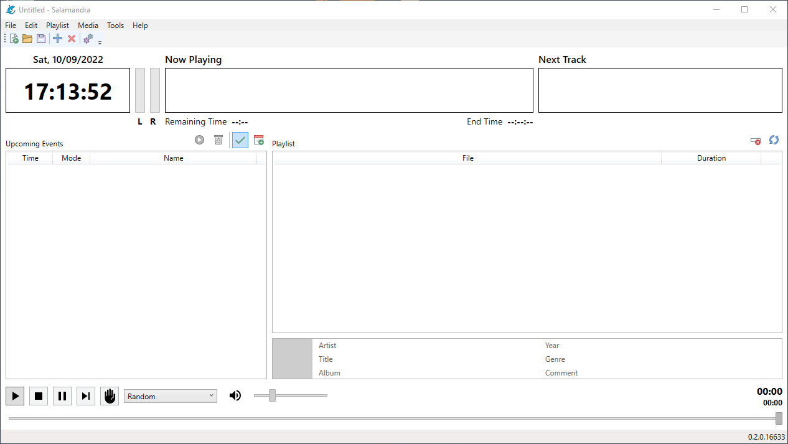
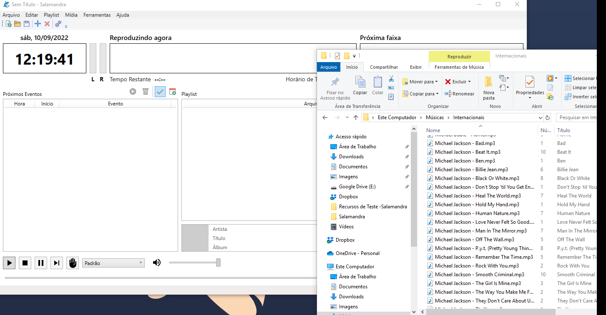
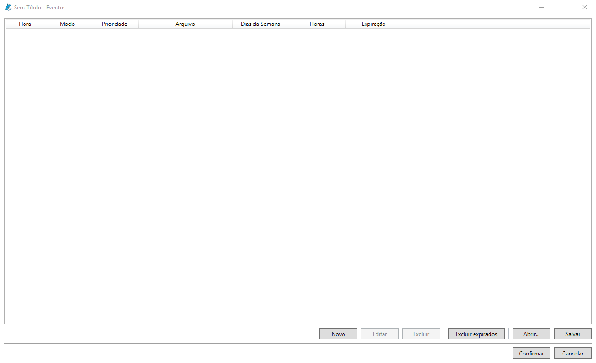

# Primeiros Passos

Olá, se você nunca utilizou o Salamandra, este tutorial é para você! Neste tutorial vamos explorar algumas opções básicas do programa para cumprir as necessidades básicas de qualquer rádio.

Os seguintes temas serão explicados nesse tutorial:

* Configurar a linguagem do Salamandra
* Criar a playlist musical
* Configurar os arquivos de Locução de Hora
* Agendar um bloco de anúncios com os eventos
* Agendar um bloco de anúncios com playlist sequencial
* Agendar uma playlist musical
* Agendar um programa utilizando as prioridades

# Linguagem do Programa

O Salamandra começa por padrão em Inglês, mas tem disponível tradução para Português. Para alterar a língua, acesse o menu **Tools > Settings** ou clique no botão superior de engrenagem e troque de English para Português na janela que se abrir. Qualquer dúvida, basta fazer como na animação abaixo.

**É NECESSÁRIO REINICIAR O PROGRAMA PARA QUE ESTA CONFIGURAÇÃO SEJA APLICADA!**

	

# Criando a playlist musical

## Entendendo a Tela Inicial

Antes de começar a explicar como fazer a sua programação musical, vamos a uma breve descrição da tela inicial do Salamandra.

	

* 1 - **Menu Principal e Barra de Ferramentas** - Onde você poderá acessar as diversas funções do programa separadas em categorias.
* 2 - **Cabeçalho do Player** - Onde você poderá ver o horário, a faixa que está sendo reproduzida no momento e a próxima faixa.  
* 3 - **Planilha de Eventos** - Onde você poderá ver os próximos eventos que serão reproduzidos e também acessar o agendador de eventos.
* 4 - **Playlist** - Onde você poderá colocar as faixas que serão tocadas na sua rádio.
* 5 - **Controles do Player** - Controles do player, volume, modo da playlist e posição da faixa atual.

## Adicionando faixas à Playlist

Para adicionar faixas a playlist, você pode utilizar o menu **Playlist**, onde você terá a opção de adicionar os diversos tipos de faixa suportados pelo Salamandra, como faixas de áudio, locuções de hora ou arquivos aleatórios. 

Você também pode arrastar arquivos direto do explorador de arquivos do sistema para a sua playlist. As faixas da playlist também podem ser reordenadas arrastando e soltando, para que você possa fazer sua programação musical na ordem que deseja.

	

Para manter uma playlist já montada salva, basta utilizar o menu **Arquivo > Salvar** ou o botão de disquete na Barra de Ferramentas. Para abrir uma playlist salva, basta utilizar o menu **Arquivo > Abrir** ou o botão de pasta na Barra de Ferramentas.

Após montar a playlist, basta utilizar os **Controles do Player** para começar a tocar as suas músicas. 

# Configurando os arquivos de Locução de Hora

Para configurar os arquivos de Locução de Hora, basta acessar o menu **Ferramentas > Configurações** ou o botão de engrenagem na Barra de Ferramentas. Você então terá acesso a janela de Configurações.

Basta então acessar a opção **Caminho para arquivos de Locução de Horário**, clicar no botão [...] e selecionar a pasta onde estão seus arquivos de horário.

	

Os arquivos devem estar no seguinte formato. **HRSxx** e **MINxx**, onde o **xx** representa um número indicando o tempo. Um arquivo para 8h da manhã, por exemplo, seria **HRS08**, para o minuto 59, seria **MIN59**. Estes arquivos então são automaticamente combinados pelo Salamandra para indicar a hora nas faixas de Locução de Hora.

Os arquivos de locução de hora podem estar em qualquer um dos formatos de áudio suportados pelo Salamandra.

# Agendar um bloco de anúncio com eventos

A forma mais fácil de montar uma programação de bloco de anúncios ou agendar qualquer outra ação do player é através do agendador de eventos. Logo acima da **Planilha de Eventos**, clique no botão de calendário. Será aberta então a seguinte janela:

	

Esta janela mostra todos os seus eventos cadastrados, permitindo que você crie novos, edite ou exclua eventos já cadastrados.

## Agendando as Locuções de Hora

Vamos criar então um alguns eventos de locução de hora que serão disparados de 15 em 15 minutos, para dar a entrada do nosso bloco de anúncios. Clique em **Novo** e siga os seguintes passos:

	

Como pode notar, teremos ao fim quatro eventos que serão disparados aos minutos 00, 15, 30 e 45. Vamos a uma explicação então do agendamento destes.

	

Em **Data e Hora de Início**, colocamos o horário do evento e logo em seguida, a primeira opção a ter sido marcada foi a opção **Imediato**. Esta opção significa que o evento entrará exatamente no horário agendado - **isso significa que qualquer música que esteja tocando será cortada para a entrada do evento**. Se você deseja que a música toque até o final e logo seguida o evento, não marque esta opção!

Vamos então a explicação da opção **Horários e Dias**. Quando marcamos **Outros Horários**, indicamos ao salamandra que queremos que o evento toque em mais horários do que o configurado inicialmente (17:00:00). Podemos então marcar as horas, neste caso de 08h até 19h, que o evento será disparado. Caso você deseje que o evento toque apenas em um horário específico, não marque esta opção. 

Note que o horário original muda para (__:00:00), isto significa que o evento tocará em todos os horários selecionados aos zero minutos e zero segundos, 8:00:00, 9:00:00, 10:00:00, etc.

Já a opção **Dias da Semana**, torna o agendamento do evento periódico, assim como a opção anterior. Quando você marca esta opção, você indica ao Salamandra que deseja que o evento toque em mais dias do que só o configurado em **Data e Hora de Início**. Caso você deseje que o evento toque apenas em um único dia específico, não marque esta opção!

Após isto, basta selecionar o **Tipo de Evento**. Para as locuções de hora, basta nós selecionarmos **Locução de Hora**. Para arquivos de áudio, como veremos em seguida, devemos clicar no botão [...] e selecionar o arquivo que desejamos.

Após isto, como queremos que os eventos toquem de 15 em 15 minutos, basta copiar e colar o evento original e apenas trocar a minutagem de acordo.

## Agendando anúncios pelos eventos