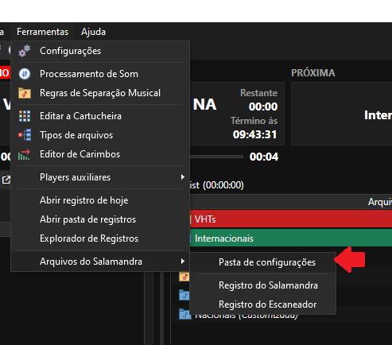
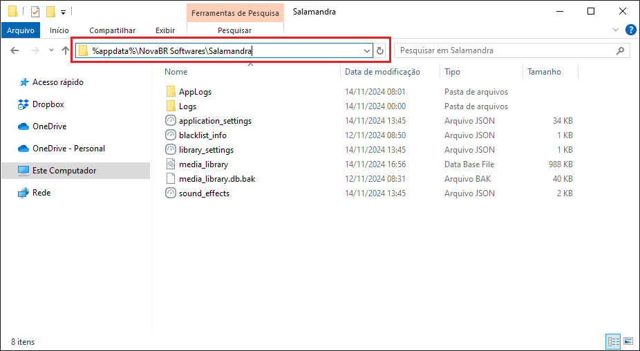

# Como fazer backup das configurações do Salamandra?

Caso você deseje fazer um backup das configurações do Salamandra, seja para formatar sua máquina, antes de instalar uma nova versão, ou para transferir para outro computador, você pode seguir as orientações abaixo.

## Localizando a Pasta de Configurações.

Para fazer um backup das configurações, primeiro você deve encontrar a pasta de configurações do Salamandra. É possível localiza-la nos caminhos abaixo:

- **Portátil**: Vá até a pasta de instalação do Salamandra, procure a pasta **Settings** e entre nela.
- **Instalável**: No explorador do Windows, digite o seguinte na parte superior: %appdata%\NovaBR Softwares\Salamandra.

	

Caso você tenha uma versão mais recente do Salamandra, você pode acessar o menu **Ferramentas > Arquivos do Salamandra > Pasta de Configurações**. Este menu abrirá para você a pasta correta, seja portátil ou instalável.

	

Ao encontrar, você vai ver uma pasta com um conteúdo bem similar à imagem acima.

## Fazendo o Backup

Para fazer o backup, primeiro **FECHE O SALAMANDRA**. É importante encerrar o programa primeiro, para que ele possa encerrar qualquer trabalho que esteja fazendo nos arquivos de configuração e você possa copiá-los sem que os arquivos fiquem corrompidos ou faltando informações.

Após fechar, copie todos os arquivos contidos na pasta para outra pasta, pen-drive ou qualquer mídia segura para armazenar o seu backup.

## Utilizando o Backup

Para restaurar o backup, siga os mesmos passos descritos antes para encontrar a pasta de configurações do Salamandra onde você deseja restaurar um backup feito anteriormente. Caso você tenha feito uma nova instalação do Salamandra e ainda não tenha aberto ela, primeiro abra o Salamandra para que ele possa criar a a pasta de configuração com todos os parâmetros de fábrica.

Com a pasta de configurações criada, então **FECHE O SALAMANDRA!** caso ele esteja aberto. Para que seu backup seja aplicado corretamente, é necessário fechar o Salamandra para não perder qualquer arquivo de configuração.

Após fechar o Salamandra, copie todo o backup feito anteriormente para a pasta de configurações. Se necessário, você pode confirmar para substituir os arquivos que já existem. Depois de copiar os arquivos, você poderá abrir o Salamandra com todas as suas configurações anteriores.

	

Sua pasta deverá ficar similar a esta após colar os arquivos de configurações. Observe que para que as configurações se apliquem corretamente, os arquivos não devem estar em outra subpasta dentro da pasta de configurações!