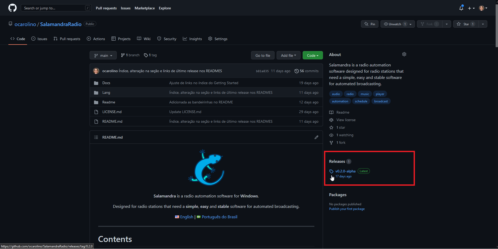
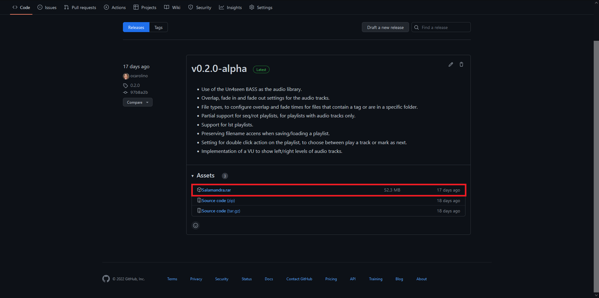

# Como instalar o Salamandra

- [Baixando o Salamandra](#baixando-o-salamandra)
- [Versão Instalável](#versão-instalável)
  - [Migrando da Versão Portátil](#migrando-da-versão-portátil)
    - [Versões antes da 0.5.3](#versões-antes-da-053)
    - [Versões da 0.5.3 em diante](#versões-da-053-em-diante)
- [Versão Portátil](#versão-portatil)
  - [Instalando o Salamandra](#instalando-o-salamandra)
  - [Atualizando o Salamandra](#atualizando-o-salamandra)
    - [À partir da 0.5.3 em diante](#á-partir-da-053-em-diante)
    - [Versões antes da 0.5.3](#versões-antes-da-053)

## Baixando o Salamandra

Para baixar o Salamandra, basta vir a [página principal](https://github.com/ocarolino/SalamandraRadio) do projeto e procurar a seção **Releases**.

Clique então **sobre a versão que está sendo exibida** e você chegará a página com o link de download para o Salamandra.

Nesta página você sempre verá a versão mais recente do Salamandra no topo, com uma breve descrição das novas funcionalidades ou correções de bugs que ela contém. 

Procure pelo link **Salamandra.rar** (para a versão portátil) ou **Salamandra-installer.rar** (para a versão instalável), onde basta clicar para baixar o programa.

## Versão Instalável

Baixe o arquivo **Salamandra-installer.rar** em uma pasta conveniente para você. Então extraia o arquivo e execute o **Salamandra-installer.exe**. Após fazer isso, basta seguir o passo a passo do instalador. 

Para atualizar, basta seguir o mesmo processo de baixar e executar o instalador e todo o processo será feito automaticamente.

### Migrando da Versão Portátil

Se você estava com a versão portátil e deseja migrar para a versão instalável, o processo também é bastante simples, mas você precisará ser cuidadoso. Siga os passos abaixo, verificando qual é a versão que você tem instalada no momento.

#### Versões antes da 0.5.3

1. Instale o Salamandra e **abra-o pela primeira vez**, para que ele prepare as pastas de configuração.
2. Acesse a pasta **%appdata%/NovaBR Softwares/Salamandra** e exclua os arquivos nela contidos. **ESTE PASSO É VITAL PARA SUAS CONFIGURAÇÕES FICAREM CORRETAS.**
3. Copie os arquivos **application_settings.json** e **directory_library.json** da pasta da versão portátil para a pasta **%appdata%/NovaBR Softwares/Salamandra**.

#### Versões da 0.5.3 em diante

1. Instale o Salamandra e **abra-o pela primeira vez**, para que ele prepare as pastas de configuração.
2. Acesse a pasta **%appdata%/NovaBR Softwares/Salamandra** e exclua os arquivos nela contidos. **ESTE PASSO É VITAL PARA SUAS CONFIGURAÇÕES FICAREM CORRETAS.**
3. Acesse o diretório Settings da pasta da versão portátil e copie todo seu conteúdo para a pasta **%appdata%/NovaBR Softwares/Salamandra**.

## Versão Portátil

### Instalando o Salamandra

Para a versão portátil do Salamandra não é necessário um processo de instalação, basta você baixar o arquivo **Salamandra.rar** em uma pasta que seja conveniente para você e então extraí-lo e procurar o **Salamandra.exe** para executá-lo. 

Após a extração você pode criar um atalho na sua área de trabalho para abrir o Salamandra mais rapidamente no futuro. Basta clicar com o botão direto sobre o executável e ir na opção **Enviar para > Área de trabalho**.

### Atualizando o Salamandra

#### À partir da 0.5.3 em diante

Se você está na versão 0.5.3 e deseja atualizar para uma versão mais recente, siga o procedimento abaixo.

Você deverá acessar a pasta do Salamandra e excluir todos os arquivos e pastas, **EXCETO** a pasta **Settings**. Nessa pasta estão todas as informações para as configurações do Salamandra.

Após isso, basta então refazer o processo para baixar uma versão mais atual e extraí-la na mesma pasta. Mantendo essa pasta, você terá todas as configurações preservadas, podendo então aproveitar as novas funcionalidades sem interferir no que já estava configurando.

#### Versões antes da 0.5.3

Se você está na versão 0.5.2 ou abaixo e deseja atualizar para a 0.5.3 ou superior, siga o procedimento abaixo.

O processo de atualização para a versão portátil é simples, mas é necessário que você seja cuidadoso. Basta abrir a pasta onde você extraiu e excluir todos os arquivos, **EXCETO** o **application_settings.json** e o **directory_library.json**, pois estes são os arquivos onde o Salamandra guarda suas configurações.

Após isso, basta então refazer o processo para baixar uma versão mais atual e extraí-la na mesma pasta. Mantendo os dois arquivos, você terá todas as configurações preservadas, podendo então aproveitar as novas funcionalidades sem interferir no que já estava configurando.