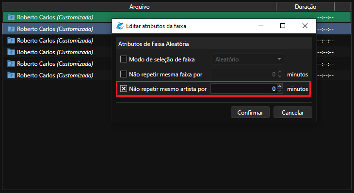

# Como configurar a separação musical no Salamandra

## Utilizando as Regras de Separação

A partir da versão 0.6.0, o Salamandra conta com as configurações de separação musical, para que não se repita a mesma faixa ou artista dentro de um determinado período de tempo.

Você pode adicionar as faixas aleatórias que respeitarão as regras de separação pelo menu **Playlist > Adicionar arquivo aleatório de pasta (com separação)**.

	

As regras de separação **apenas funcionarão na pasta com o símbolo azul.** As pastas antigas, com o símbolo pardo NÃO OBECEDEM OS TEMPOS, apenas seguem a regra de tocar toda a música da pasta até não haver mais opção, para então repetir.

Para configurar os tempos a serem respeitados, você pode acessar o menu **Ferramentas > Regras de Separação Musical**.

	

Este menu abrirá a seguinte janela, onde você poderá configurar os tempos padrões para as pastas.

	

Note que você também pode configurar os separadores para como serão reconhecidos múltiplos artistas, deixando um por linha. O Salamandra já vem com alguns identificadores padrões, mas você pode adicionar e remover ao seu gosto.

Há a opção também de **usar apenas o artista principal para separação**. Caso ativada, apenas o primeiro artista reconhecido nas músicas será considerado para as regras.

### Configuração Customizada

Caso para uma pasta (ou pastas) você deseje customizar os tempos das regras de separação, você pode clicar com o botão direito sobre ela na playlist e acessar a opção de **Editar atributos da faixa**.

	

Será aberta para você a janela de edição de atributos da faixa, onde você pode escolher o modo de seleção de faixa e os tempos de separação. Caso você não ative as opções de customização, serão utilizada as opções padrão. Para os tempos de separação, é possível utilizar o tempo 0 (zero), para desativar aquela regra específica.

	

As pastas que tem uma configuração customizada estarão com a informação *(Customizada)* em itálico ao lado de seu nome. O atributo definido só funcionará **na faixa específica configurada**! Se você tiver várias cópias do mesmo caminho na playlist, será necessário copiar e colar novamente se você desejar replicar a mesma customização em todas.

Observe também que para guardar estas customizações, você deverá salvar a playlist como **.m3u, .slrot ou .slseq**. Os formatos .lst, .rot e .seq NÃO SUPORTAM qualquer espécie de customização.

--

Nos eventos, você também pode customizar os atributos de uma faixa clicando no botão de engrenagem ao lado do caminho da pasta.

	

## Como o Salamandra identifica os artistas?

Para que o Salamandra possa identificar os artistas de suas músicas, seu acervo deve estar bem organizado, seja via tags ou nome de arquivo. Primeiro, o Salamandra checa as **tags** de artista e título da faixa, caso tenha informações nesses campos, o que tiver informado neles será considerado. 

Observe que o programa **não tem como validar se as informações das tags são corretas ou não!** Dependendo da fonte onde você conseguiu o arquivo de uma música, podem vir informações preenchidas ali que não correspondem a canção de fato - cabe a você como usuário organizar seu acervo.

Caso não haja nenhuma informação nas tags do arquivo relacionadas à artista e título, o Salamandra detectará através do nome do arquivo. O nome dos arquivos devem estar no formato **ARTISTA - TÍTULO** para serem detectados. Tendo um hífen no arquivo, o Salamandra captará a informação antes do primeiro hífen como o artista, e o restante como título da música.

O Salamandra detectará também se a canção tem múltiplos artistas através dos separadores, mas pra isso, as músicas tem que estar bem organizadas. Seja via tags ou nome do arquivo, múltiplos artistas devem estar no mesmo campo: **"Artista1 feat. Artista2 - Título"**, por exemplo. 

Caso esteja "Artista1 - Título feat. Artista2", o segundo artista não será detectado. Outra coisa a observar é que os nomes do artista também devem ser padronizados, "Beatles", por exemplo, se houver músicas como "Beatles", outras como "The Beatles", ou "Os Beatles", estes serão considerados como artistas diferentes.

## Como funcionam as regras de separação?

Para as regras de separação funcionarem corretamente, suas pastas devem ter música o suficiente para aplica-las. Caso as pastas não tenham, o Salamandra selecionará uma faixa aleatória sem obedecer as regras. Quando isso acontecer, você poderá ver no registro em texto ou no histórico a informação ao lado do nome do áudio: *Picked at random. Couldn't apply separation rules. (Selecionado aleatoriamente. Não foi possível aplicar regras de separação.)*. O Salamandra faz essa seleção aleatória em vez de pular ou ignorar a pasta para que não se quebre a sequencia que foi planejada na playlist.

As regras por padrão pedem que as faixa não se repitam por 1440 minutos (1 dia). Caso uma de suas pastas que está na playlist tenha menos do que isso, essa pasta correrá o risco de ter repetições. 

O mesmo vale para uma pasta que não tenham artistas o suficiente para a separação de artistas, ou tenham músicas apenas de um artista, nessas também haverá o risco de repetição. Para estas pastas específicas, você pode utilizar a opção de editar atributos para escolher uma configuração que seja conveniente.

Para pastas que tenham um único artista, por exemplo, você pode configurar da seguinte forma:

	

Observe que tenho a mesma pasta várias vezes em minha playlist. Como desejo fazer um especial de um determinado artista, uso as pastas com separação para utilizar as regras, porém em seu atributo, desativo a regra para artista com valor 0 (zero). Dessa forma, ele continuará seguindo as regras padrão de repetição de faixa, evitando de correr o risco da mesma música de tocar duas vezes. Caso eu não desativasse as regras para artista, **haveria o risco de ambas as regras serem ignoradas**.

Tenha em conta que a repetição de uma mesma faixa está ligada também a **periodicidade** de uma pasta! Como neste caso estou repetindo a mesma pasta dentro de um pequeno espaço de tempo, há a necessidade de criar este ajuste de regras. Porém, se a pasta tivesse artistas mais variados, ou fosse uma única pasta em uma playlist com vários outros artistas, não haveria essa necessidade.