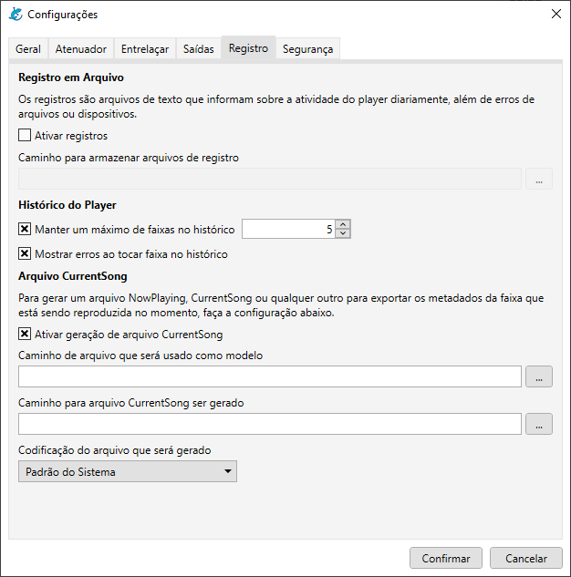
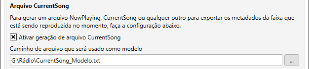
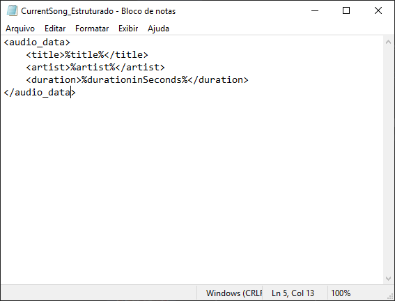
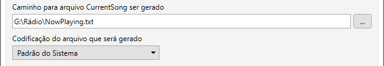

# Como gerar o arquivo CurrentSong

Para a exportação dos metadados, o Salamandra pode gerar um arquivo CurrentSong, NowPlaying ou outro qualquer, para que você possa integrar essa informação em um outro programa, como um programa de Streaming.

Você pode acessar as configurações do CurrentSong através do menu **Ferramentas > Configurações**, acesse então a aba de **Registro** na janela que se abrir e você terá a tela abaixo.

    

Para utilizar o CurrentSong, antes de mais nada, é necessário ativar a opção **Ativar geração de arquivo CurrentSong**.

## Arquivo de Modelo

O Salamandra não tem um formato padrão para gerar os arquivos de CurrentSong, dando a liberdade do usuário de gerar este arquivo no formato que ele queira. Para guiar esse formato, você deve definir o **Caminho do arquivo que será utilizado como modelo**. 

    

Este arquivo pode ser um arquivo de texto simples ou até mesmo outro formato mais estruturado, como um XML. Você pode ver alguns exemplos abaixo:

    

<strong>Modelo simples p/ CurrentSong</strong>

    

<strong>Modelo estruturado p/ CurrentSong</strong>

Dessa forma, o Salamandra consegue gerar um arquivo de saída da forma desejada pelo usuário, podendo ser ajustado para ser lido por qualquer programa que precise dessas informações. 

Para montar um arquivo, basta utilizar algum editor de texto como o **Bloco de Notas** e ver a lista dos tokens abaixo para saber quais informações o Salamandra disponibiliza para gerar o arquivo.

### Tipos de Arquivo

Normalmente, as informações de Tags das músicas são mais completas do que de comerciais ou programas gravados, por exemplo. Para estes, se você desejar, é possível customizar o modelo que será utilizado também, através dos <a href="https://github.com/ocarolino/SalamandraRadio/blob/main/Lang/Docs/File%20Types.pt-br.md">Tipos de Arquivos</a>.

## Arquivo de Saída

Para gerar o arquivo de saída, defina a configuração **Caminho para arquivo CurrentSong ser gerado**. O arquivo de saída é um arquivo de texto, mas não há uma extensão fixada. Você poderá definir o arquivo de saída como **TXT**, **XML**, apenas colocando a extensão no nome do arquivo, de acordo com a sua necessidade.

**Atente para a configuração da codificação de saída!** Seu programa de streaming pode pedir uma codificação de texto específica, então verifique esta configuração caso aconteça qualquer problema.

    

## Tokens

### Tokens da Faixa de Áudio

**%friendlyname%** - O "nome amigável" da faixa. Geralmente o nome do arquivo sem a sua extensão.

**%durationInSeconds%** - A duração em segundos do arquivo de áudio.

**%artist%** - Tag de artista da arquivo de áudio.

**%title%** - Tag de título da arquivo de áudio.

**%album%** - Tag de álbum da arquivo de áudio.

**%track%%** - Tag de faixa da arquivo de áudio.

**%year%** - Tag de ano da arquivo de áudio.

**%genre%** - Tag de gênero da arquivo de áudio.

**%composer%** - Tag de compositor da arquivo de áudio.

**%comment%** - Tag de comentário da arquivo de áudio.

### Outros Tokens

#### Hora

**%time_now_hour%** - Hora atual

**%time_now_minute%** - Minuto atual

**%time_now_second%** - Segundo atual

**%time_now_short%** - Hora atual em formato curto

**%time_now_long%** - Hora atual em formato longo

#### Data

**%date_now_day%** - Dia atual

**%date_now_month%** - Mês atual

**%date_now_year%** - Ano atual

**%date_now_short%** - Data atual em formato curto

**%date_now_long%** - Data atual em formato longo