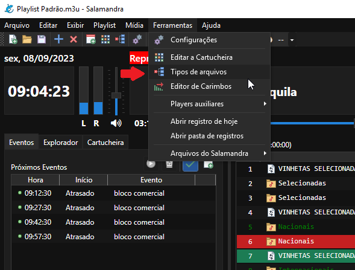
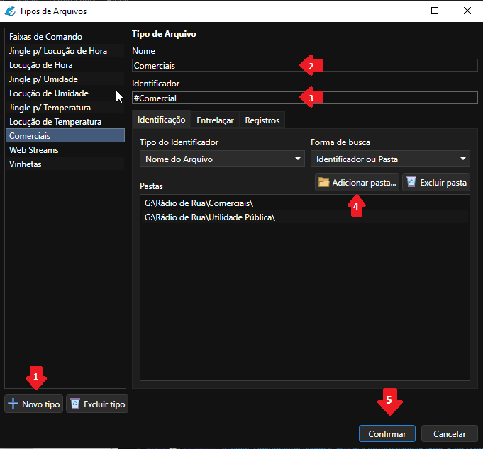
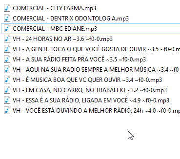
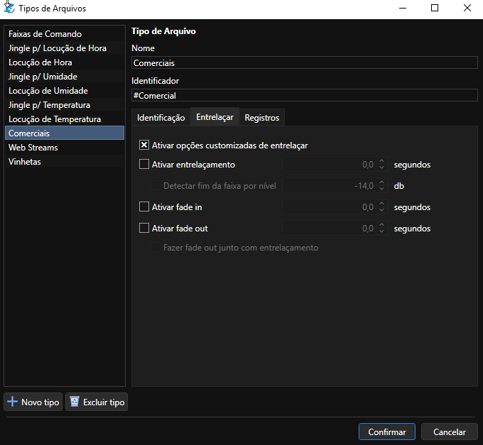

# Como não cortar o fim dos áudios?

Uma dúvida comum entre os usuários do Salamandra é como não cortar o fim dos áudios, como os comerciais, mas ainda manter a mixagem nas músicas. Para isso você deverá utilizar a opção de Tipos de Arquivo, que você pode acessar através do menu **Ferramentas > Tipos de Arquivo**.

	

Na janela em que se abre, você precisará seguir os seguintes passos:

	

Clicar no botão de **Novo Tipo (1)**. No campo de **Nome (2)**, coloque um nome para identificar o tipo do arquivo. Pode ser Comercial, Vinheta, etc, referente ao que você deseja configurar - é apenas uma descrição para o seu entendimento.

No campo de **Identificador (3)**, se você tem uma pasta exclusiva só para comerciais, outra só para vinhetas, etc, ignore esta função. Se estão espalhados em muitas pastas, ou uma mesma pasta estão junto comerciais, vinhetas, etc, configure uma **palavra em comum** que aparece nos seus arquivos. Por exemplo, os comerciais todos tem **Comercial** no nome, as vinhetas começam com **VHT**, etc.

	

    Apenas use a opção de Identificador (3) se seus arquivos estão misturados assim, se não, pode ignorar.

No botão de **Adicionar pasta (4)**, você adiciona as pastas que sejam referentes a esse tipo de arquivo, as pastas onde estão seus comerciais, se você estiver criando um tipo para comerciais, por exemplo.

Assim, basta clicar em **Confirmar** e seus arquivos não cortarão mais, conforme a configuração feita.

## Customizando a mixagem

Se você quiser algo extra, como por exemplo, criar uma mixagem customizada, em vez de simplesmente desativar, você pode ir na aba **Entrelaçar** e configurar a mixagem de acordo como desejar, ativando ou desativando os campos.

	

