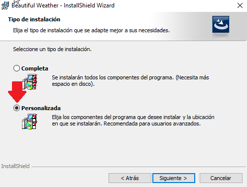
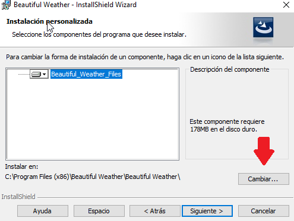
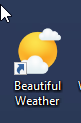
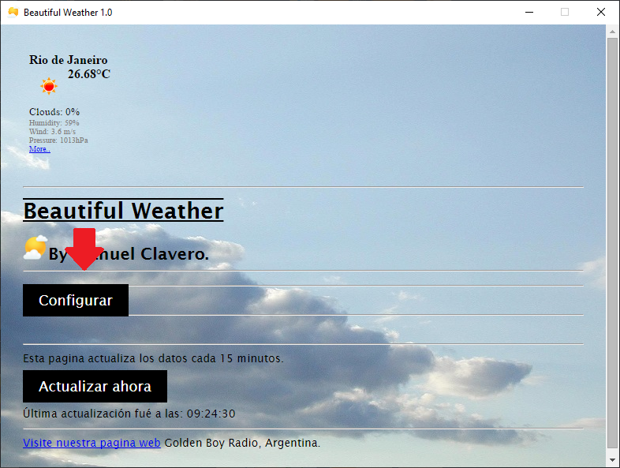
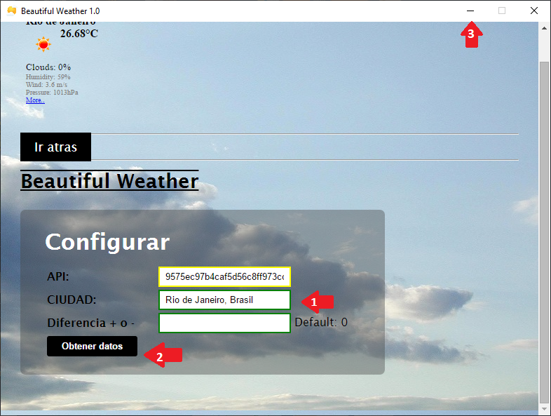
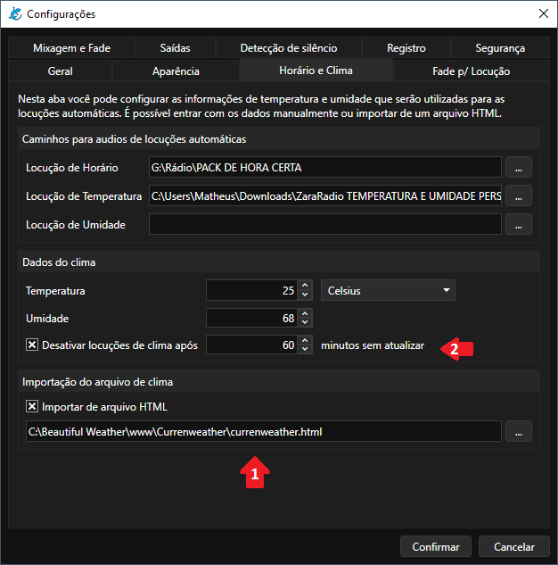

# Como configurar as locuções de Temperatura e Umidade

## Instalando o Beautiful Weather

Para ter os dados de temperatura e umidade automaticamente no Salamandra, você pode baixar o programa [Beautiful Weather - (clique aqui para baixar)](https://drive.google.com/file/d/1cMO5RUQXLdQ7zY7p3YTB1rfrgi0h9v5l/view?usp=sharing). Porém, para que o programa funcione corretamente, você deverá seguir as instruções abaixo durante a instalação.

Primeiro, você deverá baixar o arquivo **BW1.0 setup.zip** e extrair em uma pasta qualquer. Após isso, execute o arquivo **BW1.0 setup.exe** e avance as opções até chegar na tela abaixo.

Aqui, escolha a opção de instalação **Personalizada**.

	

Clique então no botão **Cambiar** para escolher uma nova pasta de instalação.

	

Navegue então até o **Disco Local C**, ou outra raíz de disco que tenha em seu computador e **Crie uma nova pasta** e de o nome de Beautiful Weather. Dê dois cliques então para selecionar a pasta e siga em **Aceptar**. Se tiver dificuldade, apenas imite o vídeo de demonstração que tem logo abaixo.

	

Após esses passos, basta seguir o instalador até que finalize a instalação. Será criado um atalho na sua área de trabalho do Beautiful Weather, dê dois cliques e abra-o.

	

## Configurando o Beautiful Weather

Após abrir o Beautiful Weather, clique no botão **Configurar**.

	

No campo **CIUDAD (1)**, você deverá então entrar com o nome da sua cidade, **no formato "CIDADE, PAIS"**, ex: Rio de Janeiro, Brasil. Clique então no botão **Obtener dados (2)**, para voltar a tela inicial, onde deverá aparecer o clima da sua cidade. Depois **minimize o programa (3)** e não precisará mais mexer no Beautiful Weather.

Se não aparecer, repita os passos, verificando se o nome e pais estão corretos.

	

## Configurando o Salamandra

Agora, você deverá acessar o Salamandra. Vá ao menu **Ferramentas > Configurações**. Acesse a aba **Horário e Clima**.

	

Marque a opção **Importar de arquivo HTML (1)** e configure o caminho do arquivo currenweather.html no campo de texto. Se você estiver seguindo o passo a passo, estará no caminho **C:\Beautiful Weather\www\Currenweather\currenweather.html**.

Você pode ativar a opção **Desativar a locução de clima após x minutos (2)**, para caso tenha algum problema na atualização dos dados, não sejam anunciados a temperatura e umidade antigas.