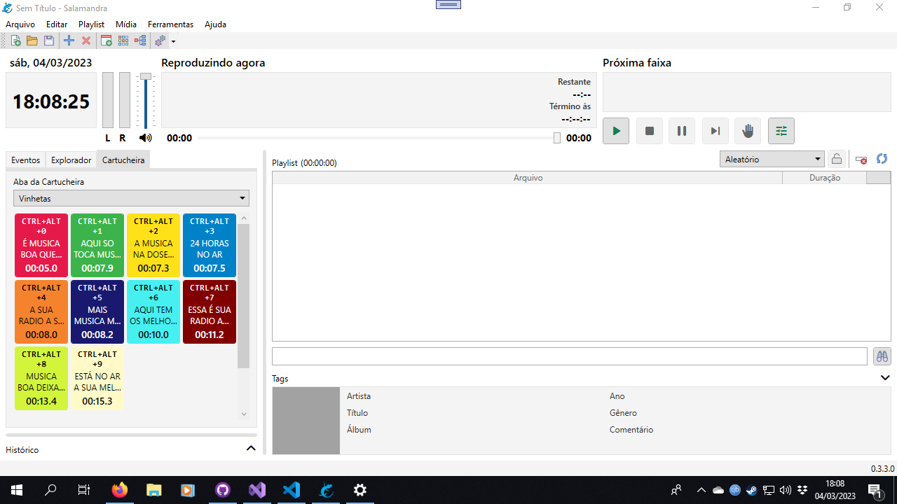
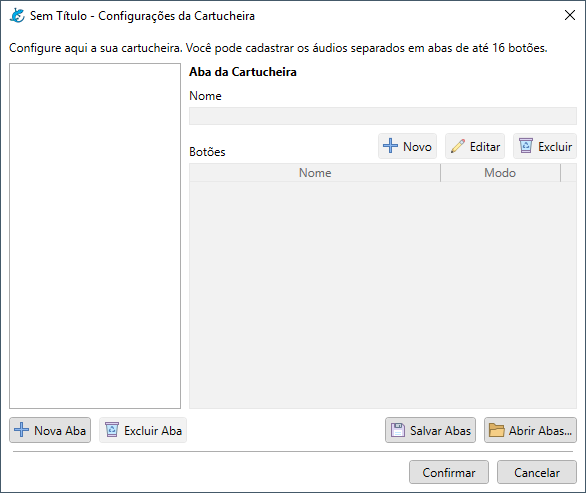
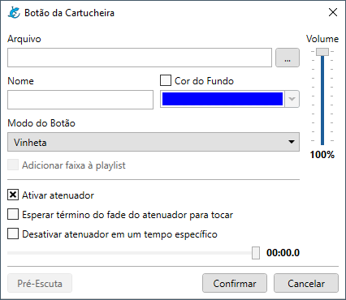
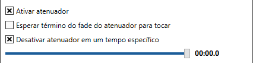
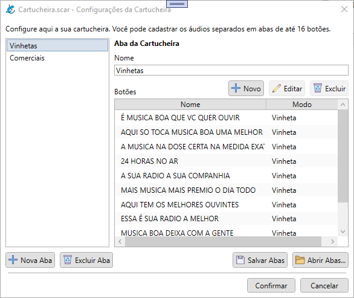

# Como utilizar a Cartucheira

- [Botões da Cartucheira](#botões-da-cartucheira)
  - [Modo do Botão](#modo-do-botão)
    - [Opções para Vinhetas](#opções-para-vinhetas)
  - [Ordem dos Botões e Abas](#ordem-dos-botões-e-abas)

A Cartucheira do Salamandra é um recurso que serve para você cadastrar diversos botões de arquivos de áudios, para que possam ser tocados instantâneamente, como Jingles ou Vinhetas, ou adicionados à playlist, para montar mais rapidamente sua programação.

Você pode acessar a Cartucheira no lado esquerdo da Janela Principal, clicando sobre a Cartucheira.

	

Para acessar as configurações da cartucheira, vá ao menu **Ferramentas > Configurações da Cartucheira**. Você verá a tela abaixo:

	

Para configurar a cartucheira, primeiro você deve clicar no botão **Nova Aba**. Você poderá então colocar um nome para esta aba, como uma categoria, "Vinhetas da Rádio", "Vinhetas para Músicas", etc. Em seguida, clique no botão **Novo**, que está em cima da lista de botões, para incluir um novo botão.

Após definir todos os seus botões, você pode utilizar as funções de **Salvar Abas** e **Abrir Abas**, para salvar em arquivos. Isso serve para caso você prefira organizar suas cartucheiras em mais de um arquivo.

## Botões da Cartucheira

Para configurar um botão da cartucheira, você verá a seguinte janela:

	

Será necessário selecionar um **arquivo de áudio** que será associado ao botão. É possível também definir o **nome** e **cor de fundo**, que serão a aparência do botão e o **volume**, que caso você use o botão para Vinhetas, será o volume que será definido para a faixa. Para conferir o áudio e o volume, utilize o botão de Pré-Escuta.

Após definir essas informações básicas, teremos que definir o **Modo do Botão**.

### Modo do Botão

O botão da cartucheira poderá ter três modos:

- **Vinheta** - O áudio tocará em um player à parte, como o player da Pré-Escuta. É o modo ideal para tocar Vinhetas ou Jingles que devam tocar sobre o áudio do Player Principal.
- **Tocar Imediatamente no Player** - O áudio tocará no Player Principal de forma imediata.
- **Definir como Próxima Faixa no Player** - O áudio ficará marcado como a Próxima Faixa do Player Principal.

Para os dois modos relacionados ao Player Principal, você terá a opção de **Adicionar a faixa à Playlist**, caso você considere necessário. Já para o modo Vinheta, você terá algumas outras opções, relacionadas ao **atenuador**.

	

#### Opções para Vinhetas

- **Ativar atenuador** - Se você deseja que a vinheta utilize o atenuador, marque esta opção.
- **Esperar término do fade do atenuador para tocar** - Se você deseja que primeiro o atenuador baixe o volume principal, para depois entrar a vinheta, marque esta opção. Se deseja que ela entre instantaneamente, mantenha desmarcada.
- **Desativar atenuador em um tempo específico** - Se você deseja que o atenuador seja desativado antes do término da faixa, em áudios que terminem com muito silêncio, ou um efeito sonoro, por exemplo, marque esta opção e defina os segundos de duração no slider.

## Ordem dos Botões e Abas

Após salvar seus botões e suas abas, é possível clicar e arrastar, como abaixo, para deixá-los na ordem que seja mais conveniente para o seu trabalho.

	

O mesmo pode ser feito com as abas, para também deixar na ordem que lhe agrade.