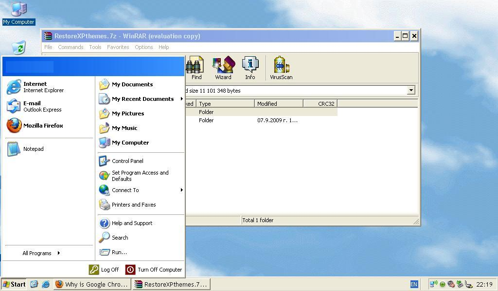
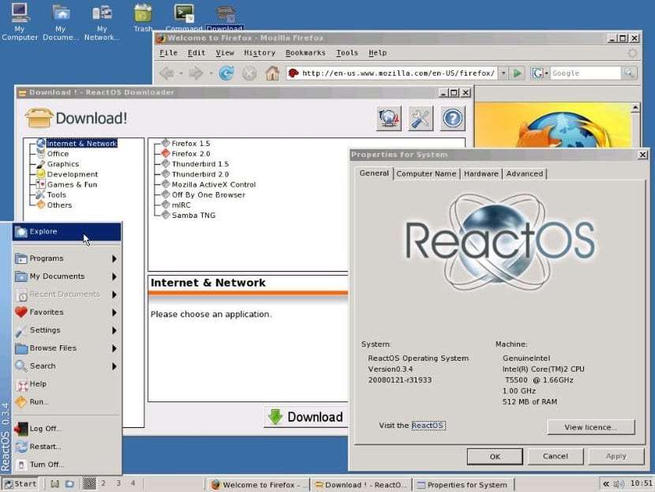
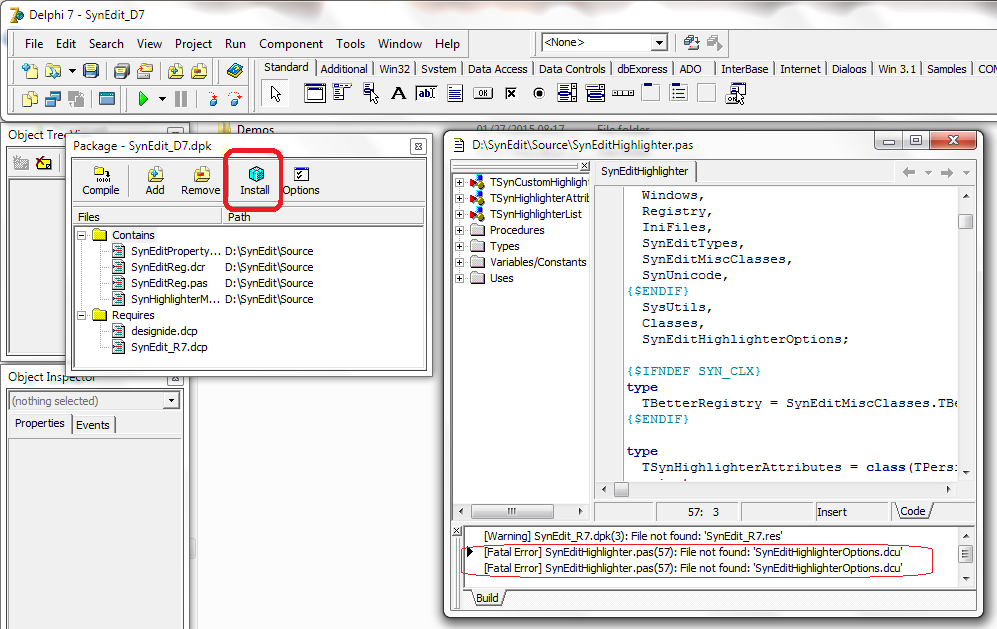
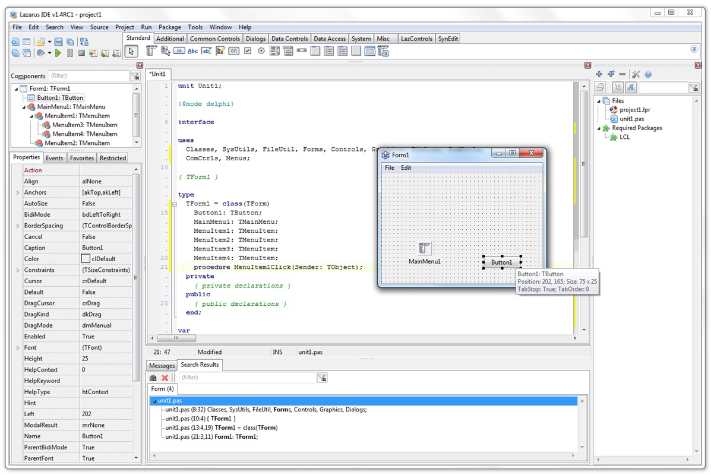
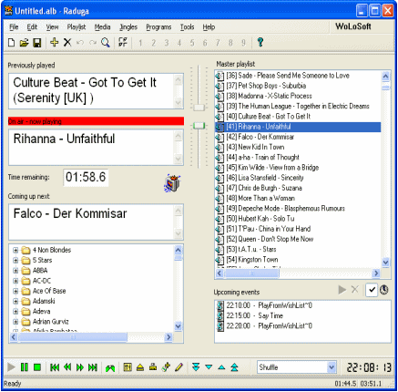

# O Salamandra é um plágio de outra automação de rádio?

Imagine que você sabe cozinhar. Você vai à algum lugar tomar um café da manhã e experimenta um bolo de cenoura. Digamos que este bolo realmente te fascine e você deseje fazer um igual a ele na sua casa. Graças a sua experiência e seus sentidos, você pode dizer se foi feito de uma massa pronta ou se foi natural da cenoura, se estava bem doce ou não, etc. À partir daí, basta imaginar o básico de como é uma receita de bolo de cenoura e experimentar fazer alguns bolos até que você alcançe o mesmo sabor que te agradou. 

Mas o interessante mesmo é que talvez no original possam ter utilizado manteiga e você utilizou óleo. Talvez a doçura do original seja com mais açucar na massa, mas a do seu vem do recheio. O que é realmente legal é saber que você alcançou o mesmo sabor através do método científico - observar, formular hipoteses, experimentar, reproduzir e analisar o resultado! Não foi necessário entrar à noite na cafeteria e roubar a receita, ou esconder uma câmera escondida para ver como faz, apenas a simples utilização da sua experiência, observação e bastante prática.

Além disso, você pode escolher distribuir os outros pedaços do bolo para não aproveitar sozinho, na esperança de que isso te dê ideias novas. Quem sabe uma das sugestões que você receba seja colocar granulado por cima do recheio? Porque algúem já experimentou um outro bolo com granulado e sugeriu que a crocância caiu bem...

Antes que comece a dar fome, acredito que você já consiga perceber onde estou querendo chegar com essa comparação. O Salamandra é o bolo, eu sou o cozinheiro e vocês usuários são as pessoas com quem decidi compartilhar minhas experiências. Então, o que é plágio no meio do software afinal? Assim como na receita de bolo, seu código pode dar uma saída parecida, mas ter uma construção totalmente diferente. 

Plágio em software não se detecta pela aparência(*), ou por ter funcionalidades parecidas. Em outras mídias, o próprio objeto é a sua identidade, se você vê um texto, uma arte ou uma foto igual sem os devidos créditos ao autor, é algo que está óbvio a cópia. Já para os softwares, a identidade de cada programa não é a aparência que você visualiza como usuário, mas é o código fonte criado pelos seus desenvolvedores. Basicamente, o código-fonte é o DNA do software, que gera o executável que você utiliza no seu dia-a-dia.

(*) exceto se estão sendo utilizados as ARTES (logos, ícones, imagens) em si que foram desenhadas para um software específico.

Dessa forma, plágio em desenvolvimento de software está associado ao **ROUBO DE CÓDIGO FONTE**, quando você trabalha/trabalhou em uma empresa específica e rouba os códigos do software que é propriedade da empresa, ou "hackeia" um software para descompila-lo e ter acesso ao código, ou apenas rouba o código de outro software aberto (*) e diz que é seu sem dar os devidos créditos. 

(*) ZaraRadio e RadioDJ, são gratuitos, mas assim como o Salamandra, não são softwares livres (de código aberto), seu código é fechado. Os desenvolvedores disponibilizam o EXE para rodar o programa, não o código para que outro possa desenvolver em cima.

Em relação ao Salamandra, nenhuma dessas atividades foi feita no processo de desenvolvimento - todo o seu código é de minha autoria, apenas fiz a escolha de criar uma aparência similar ao ZaraRadio para facilitar a transição. O Salamandra não tem código copiado, roubado, não é uma versão customizada, crackeada ou descompilada de outro software. 

Não é atoa que funções bem solicitadas como o DTMF ainda não estão inclusas no programa. É algo que não faz parte do meu conhecimento, algo que não é simples de estudar. Se fosse caso de roubo de código, muitas funções já estariam há muito tempo no Salamandra por pura conveniência. Exceto os recursos de código e arte que estão listados no GitHub e no menu Ajuda > Sobre o Salamandra, todo o código contido no Salamandra é de minha autoria.

Esta forma de trabalho não é nenhuma novidade no meio de desenvolvimento de software. Muito pelo contrário, é um processo bastante comum criar algo parecido com o que já existe, principalmente daqueles que são alternativas gratuitas à softwares pagos, justamente para que se possa aproveitar da experiência anterior dos usuários para não tornar o processo de transição de um software para outro algo mais penoso do que deveria ser.

Quando se desenvolve um software do mesmo segmento de outros softwares que já existem, muitas vezes se reinventa a roda, justamente para que aquela seja a SUA roda. Como desenvolvedor, você pode utilizar a imaginação e observação para entender o funcionamento de um software e criar um código que faça a mesma coisa. Nas imagens abaixo, você pode ver alguns exemplos de softwares pagos que vieram a ter um indivíduo ou grupo criando uma alternativa gratuita.

<table>
<tr>
    <th style="text-align: center;">Software Proprietário</th>
    <th style="text-align: center;">Alternativa Gratuita</th>
</tr>

<tr>
    <td>
 Windows XP
</td>
    <td>
 React OS
</td>
</tr>

<tr>
    <td colspan="2">
Windows, sistema operacional desenvolvido pela Microsoft e ReactOS, sua alternativa gratuita. O ReactOS não é um Linux que parece com o Windows, mas sim um sistema desenvolvido especificamente para ser uma alternativa gratuita.
</td>
</tr>

<tr>
    <td>
 Delphi 7
</td>
    <td>
 Lazarus
</td>
</tr>

<tr>
    <td colspan="2">
Delphi 7, IDE criada pela Borland para desenvolver softwares em Object Pascal e Lazarus, sua alternativa gratuita.
</td>
</tr>

<tr>
    <td>
 Raduga
</td>
    <td>
 ZaraRadio
</td>
</tr>

<tr>
    <td colspan="2">
E uma dupla que pessoalmente é minha favorita. Raduga, software desenvolvido pela WoLoSoft International e ZaraRadio, sua alternativa gratuita.
</td>
</tr>
</table>

Todos estes softwares de exemplo nas imagens (talvez o último até surpreenda alguns!) fazem o mesmo que o Salamandra - tem a proposta de ser uma alternativa gratuita a um software pago, com uma aparência bastante similar para aproveitar a experiência anterior daqueles que desejam mudar de software. São softwares gratuitos que são clones dos proprietários, mas tendo seu código-fonte construido do zero por seus programadores, o que faz que eles sejam seus autores de fato. Não são versões customizadas, crackeadas, mas sim construções feitas do zero inspiradas em algo que já existe.

Não há problema nenhum em desenvolver um software desta forma, o único problema real seria se passar pelo software original, utilizando seus nomes ou marcas, artes ou logos, ou infringindo patentes dos softwares originais. Uma coisa é certa, não há patentes que ditam que apenas uma empresa específica pode criar um player de áudio, ou apenas uma empresa possa ter um player com os nomes da faixa atual e da próxima na área superior, ou a playlist no centro, cartucheira, agendamento ou outras funções. 

Na imensa maioria dos casos, um desenvolvedor ou empresa tem direito de proteger e reivindicar a sua IMPLEMENTAÇÃO ESPECÍFICA do código, não o direito a ideia. Se outro desenvolvedor no futuro resolver olhar o Salamandra, achar suas funções interessantes e também implementar o CÓDIGO QUE ELE MESMO DESENVOLVEU para fazer a mesma coisa, ele não estará fazendo nada de errado.

Para concluir, o Salamandra é um projeto sério e desenvolvido com todo o cuidado para que possa ser utilizado também por pessoas, rádios e empresas sérias, sem que estas venham a ser prejudicadas por qualquer decisão que eu tome como desenvolvedor. Não há qualquer ilegalidade no Salamandra, muito pelo contrário, o Salamandra vem como uma ótima opção para aqueles que não desejam utilizar softwares piratas.

Este não é um post apenas educativo, mas também é uma resposta a certos comentários que recebo desde que iniciei este projeto. Como comunicadores, podemos e devemos pesquisar sobre aquilo que falamos para ter embasamento, e quando denunciamos algo, devemos ser responsáveis em expressar bem e provar aquilo que falamos, em vez fazer acusações de qualquer forma sem medir as palavras. Quando certos comentários vem de pessoas comuns, o impacto é pequeno, mas quando vem daqueles que trabalham no meio do rádio e se comunicam diretamente com um público, é apenas ser inconsequente.

Com toda segurança, posso falar para que não se preocupem, pois nada disso atrapalha o Salamandra, muito pelo contrário. Na verdade, quando vejo algo assim, penso: Será que essa pessoa nunca ouviu falar de "Falem bem ou falem mal, mas falem de mim?". Falar mal de algo serve como propaganda. Falar mal de algo quando você não tem o mínimo conhecimento de causa, é um tiro que sai pela culatra.

Como sempre, os comentários estarão abertos para o debate. Peço a todos que antes de comentar algo, lembrem-se de nossas funções como comunicadores. Não citem nomes ou links, pois uma pessoa ser irresponsável no que fala não dá abertura para que nós sejamos irresponsáveis também. Além disso, desrepeito, acusações ou especulações sem embasamento não são provas, é apenas ser inconsequente ao se expressar.

Deixo um abraço a todos e que Deus os abençoe,

Matheus Carolino.