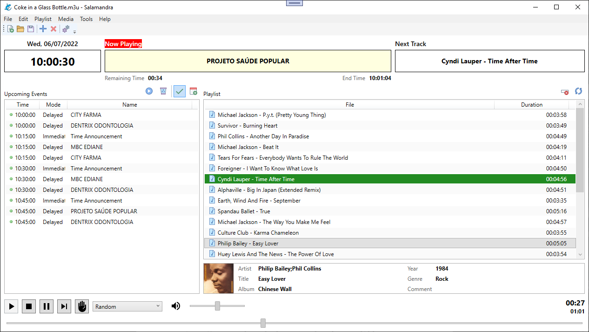
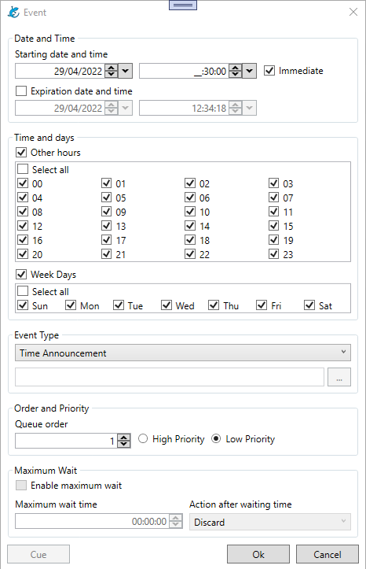
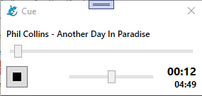
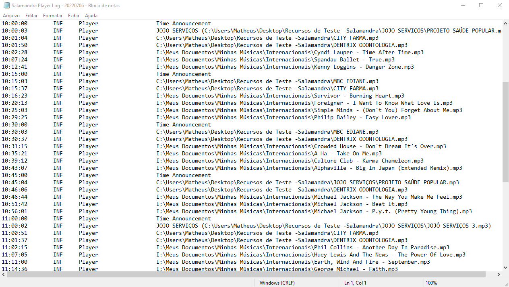

	

	<b>Salamandra</b> é um software de automação de rádio para o <b>Windows</b>.

 

	Projetado para rádios que precisam de um software <b>simples</b>, <b>fácil</b> e <b>estável</b> para programar suas transmissões.

Compatível com Windows 7 SP1 + ESE (*), 8.1, 10 and 11. 

(*) Seu Windows 7 deve estar <strong>completamente atualizado</strong> (com Service Pack 1 + Extended Security Updates) - caso tenha problemas com o Windows Update, procure como resolver o erro 80072EFE do Windows Update.

	<a href="https://github.com/ocarolino/SalamandraRadio"> English</a> | <a href="https://github.com/ocarolino/SalamandraRadio/blob/main/Lang/README.pt-BR.md"> Português do Brasil</a>

<a href="https://facebook.com/salamandraradiosoftware">Visite nos no Facebook!</a>

# Índice

- [Recursos](#recursos)
- [Primeiros Passos](#primeiros-passos)
- [Screenshots](#screenshots)
- [Contribuições](#contribuições)
- [Doações](#doações)
- [Bibliotecas e Recursos](#bibliotecas-e-recursos)

# Recursos
* Player com suporte aos formatos de áudio mais comuns (wav, mp3, wma, ogg and flac)
* Diversos modos para seleção das faixas, como aleatório, embaralhar ou manual para maior controle da programação.
* Faixas especiais, como locução de horário ou arquivos de áudio aleatórios de uma pasta.
* Um programador de eventos versátil, para faixas de áudio ou iniciar/parar o player, em um dia e hora agendados ou de forma periódica, como dias da semana ou horas do dia.
* Um player simplificado para pré-escuta de faixas de áudio em outra saída de som.
* Gerador de arquivos de log, para registrar qualquer atividade ou erros do player.

# Primeiros Passos
Você pode baixar o <a href="https://github.com/ocarolino/SalamandraRadio/releases/latest/download/Salamandra.rar">último release</a>, descompactar e abrir o **Salamandra.exe**. Não há a necessidade de instalação ou configurações extras. Nós temos os seguintes tutoriais até o momento:

- <a href="https://github.com/ocarolino/SalamandraRadio/blob/main/Lang/Docs/How%20to%20Install.pt-br.md">Como instalar/atualizar o Salamandra</a>
- <a href="https://github.com/ocarolino/SalamandraRadio/blob/main/Lang/Docs/Getting%20Started.pt-br.md#configurando-os-arquivos-de-locu%C3%A7%C3%A3o-de-hora">Configurar arquivos de Hora Certa</a>
- <a href="https://github.com/ocarolino/SalamandraRadio/blob/main/Lang/Docs/How%20to%20not%20cut%20the%20end%20of%20audios.pt-br.md">Como não cortar o fim dos áudios?</a>
- <a href="https://github.com/ocarolino/SalamandraRadio/blob/main/Lang/Docs/Getting%20Started.pt-br.md">Primeiros passos para montar sua programação</a>
- <a href="https://github.com/ocarolino/SalamandraRadio/blob/main/Lang/Docs/How%20to%20use%20the%20Cartwall.pt-br.md">Como utilizar a Cartucheira</a>
- <a href="https://github.com/ocarolino/SalamandraRadio/blob/main/Lang/Docs/File%20Types.pt-br.md">Como lidar com Tipos de Arquivos</a>
- <a href="https://github.com/ocarolino/SalamandraRadio/blob/main/Lang/Docs/How%20to%20create%20CurrentSong.pt-br.md">Como gerar o arquivo CurrentSong</a>
- <a href="https://github.com/ocarolino/SalamandraRadio/blob/main/Lang/Docs/How%20to%20setup%20Beautiful%20Weather.md">Como configurar a temperatura e umidade</a>
- <a href="https://github.com/ocarolino/SalamandraRadio/blob/main/Lang/Docs/Hotkeys.pt-br.md">Lista de Teclas de Atalho do Salamandra</a>

Em nossos tutoriais você pode ter uma visão geral das funcionalidades do Salamandra. Mas mesmo para funcionalidades que ainda não tem um tutorial, o Salamandra foi desenvolvido de forma a ser intuitivo, com todas as funções escritas de uma maneira clara. Você também pode colocar o cursor do mouse em qualquer opção e ler uma breve explicação do que ela faz.

# Screenshots

### Player Principal

	

### Programador de Eventos

	

### Player de Pré-Escuta

	

### Um dos logs diários

	

# Contribuições
Antes de qualquer coisa, obrigado por pensar em contribuir para este projeto! 

O Salamandra é um software gratuito, mas não é de código aberto - isso não quer dizer que as contribuições não são bem vindas! Você pode sempre contribuir divulgando, testando, com tutoriais/documentação, traduções, reportando bugs ou dando ideias para novas funcionalidades.

<a href="https://github.com/ocarolino/SalamandraRadio/blob/main/Lang/SUGGESTIONS.pt-br.md">Regras para Sugestões!</a>

# Doações

O modelo de doações será em breve substituido pelo Salamandra PLUS, você pode saber mais sobre isso no link: [Salamandra PLUS](https://salamandraautomacao.com/pt/plus).

# Bibliotecas e Recursos

* [BASS](https://www.un4seen.com/)
* [ManagedBass](https://github.com/ManagedBass/ManagedBass)
* [TagLib#](https://github.com/mono/taglib-sharp)
* [Serilog](https://github.com/serilog/serilog)
* [PropertyChanged.Fody](https://github.com/Fody/PropertyChanged)
* [Ookii.Dialogs.Wpf](https://github.com/ookii-dialogs/ookii-dialogs-wpf)
* [Newtonsoft.Json](https://www.newtonsoft.com/json)
* [WpfExtendedToolkit](https://github.com/dotnetprojects/WpfExtendedToolkit)
* [GongSolutions.WPF.DragDrop](https://github.com/punker76/gong-wpf-dragdrop)
* [WPFDarkTheme](https://github.com/AngryCarrot789/WPFDarkTheme)
* [Adonis UI](https://benruehl.github.io/adonis-ui/)

### Recursos de Imagem/Visuais

* [Icons8](https://icons8.com)
* [famfamfam Silk Icons](http://www.famfamfam.com/lab/icons/silk/)
* [Lizard icons created by Kiranshastry - Flaticon](https://www.flaticon.com/free-icons/lizard)
* [Font Awesome](https://fontawesome.com/)
* [Material Design Icons](fonts.google.com/icons)